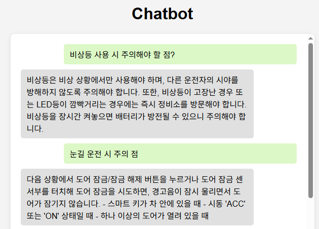

# 🧠 RAG 기반 로컬 챗봇 서버 (Flask + Pinecone + SBERT)

이 프로젝트는 `all-MiniLM-L6-v2` Sentence-BERT 모델을 사용하여 질문 데이터를 벡터로 임베딩하고, Pinecone을 벡터 DB로 활용해 로컬에서 질의응답 챗봇 서비스를 제공합니다.

---

## 📌 주요 기능

* JSONL 포맷 QA 데이터 로드
* Sentence-BERT 기반 질문 임베딩
* Pinecone에 벡터 저장 (Upsert)
* Flask API 기반 `/chat` 엔드포인트 제공
* Node.js 프론트엔드 연동 가능 (예: [http://localhost:3000](http://localhost:3000))

---

## 🧩 구성 요소

| 구성 요소                 | 설명                                                               |
| --------------------- | ---------------------------------------------------------------- |
| `Flask`               | REST API 서버 구성                                                   |
| `SentenceTransformer` | 질문 임베딩 생성 (모델: `all-MiniLM-L6-v2`)                               |
| `Pinecone`            | 벡터 저장소 (Index name: `chatbot-index`)                             |
| `JSONL 파일`            | `{ "qa_id": str, "question": str, "answer": str }` 형태의 질문-답변 리스트 |

---

## ⚙️ 실행 환경

* Python 3.8 이상
* 설치 필요 패키지: `flask`, `sentence-transformers`, `pinecone-client`, `pandas`

```bash
pip install flask sentence-transformers pinecone-client pandas
```

---

## 🛠️ 사전 준비

1. **Pinecone 가입 및 설정**

   * [Pinecone 홈페이지](https://www.pinecone.io)에서 가입
   * API Key 발급 후, Region 확인 (예: `us-east-1`)

2. **Index 생성**

   * Index 이름: `chatbot-index`
   * Metric: `cosine`
   * Dimensions: `384` (모델에 따라 달라짐)

3. **JSONL QA 데이터 준비**

   * 예시:

     ```json
     {"qa_id": "001", "question": "에어컨 자동 설정 방법은?", "answer": "에어컨 설정은 메뉴에서 자동 버튼을 누르면 됩니다."}
     ```

---

## 🚀 실행 방법

1. **`demo.py` 설정 수정**

   * 다음 항목을 여러분의 Pinecone 정보로 교체

     ```python
     PINECONE_API_KEY = "YOUR_API_KEY"
     PINECONE_ENVIRONMENT = "YOUR_ENVIRONMENT"
     ```
   * JSONL 데이터 파일 경로 수정

     ```python
     df = load_data("YOUR_JSONL_DATA_PATH")
     ```

2. **서버 실행**

   ```bash
   python demo.py
   ```

3. **정상 실행 시 출력**

   ```bash
   Setup complete. Starting Flask server on http://0.0.0.0:5000
   ```

---

## 💬 API 사용법

### 🔗 POST `/chat`

| 필드명        | 타입     | 설명      |
| ---------- | ------ | ------- |
| `question` | string | 사용자의 질문 |

**요청 예시**

```json
POST http://localhost:5000/chat
Content-Type: application/json

{
  "question": "에어컨 자동 설정 방법은?"
}
```

**응답 예시**

```json
{
  "answer": "에어컨 설정은 메뉴에서 자동 버튼을 누르면 됩니다."
}
```

---

## ⚠️ 주의사항

* `YOUR_API_KEY`, `YOUR_ENVIRONMENT`, `YOUR_JSONL_DATA_PATH`는 반드시 본인의 환경에 맞게 수정해야 합니다.
* 로컬 환경에서는 Node.js 프론트와 함께 실행 시 `http://localhost:3000`에서 연동 가능
* 잘못된 응답이 출력되는 경우는 임베딩 성능이나 질문 표현 차이에 따라 발생할 수 있습니다.

---

## 📎 참고

* 임베딩 모델: [all-MiniLM-L6-v2 (SBERT)](https://www.sbert.net/docs/pretrained_models.html)
* 벡터DB: [Pinecone](https://www.pinecone.io/)
* 프론트엔드 연동은 별도 Node.js 프로젝트 참고

---

## 🖼 구현 이미지


